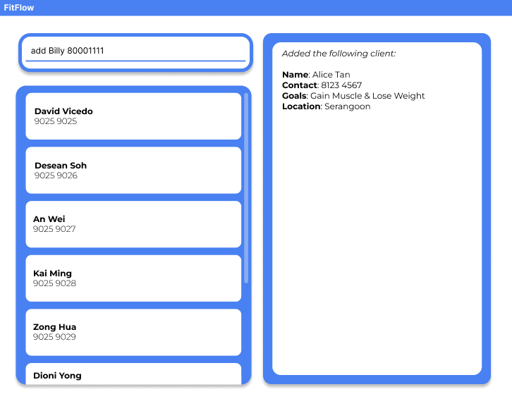

# Welcome to FitFlow!

FitFlow is a new application, designed with **Singaporean personal trainers** in mind!

Are you:
- :weary: *Frustrated* at having to keep track of all your clients' schedules?
- :computer: A *fast* typist?
- :rocket: Someone who values *efficiency*?

Then FitFlow is the app for you!

## Main Features

Fitflow is **easy to learn**, and **easy to master**!

- Keep track of all your clients' details, all in one application
- Save your client's preferred schedules
- Easy edit information when you need to
- View your daily schedules easily

## Download and use FitFlow

1. Download the latest release from the Releases tab
2. Launch the application
3. Explore and use FitFlow :thumbsup:

## Help

For the detailed documentation of this project, see the **[FitFlow Product Website](https://ay2425s2-cs2103t-t13-1.github.io/tp/)**.
