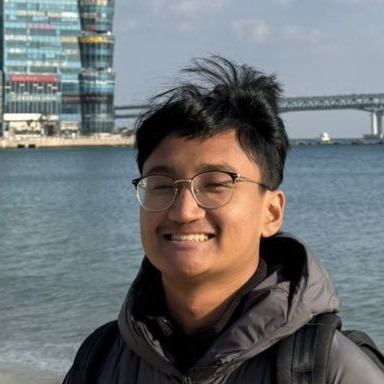
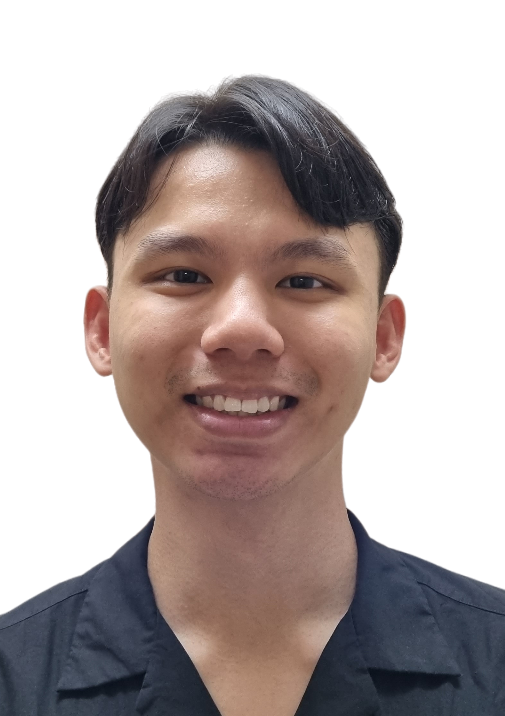
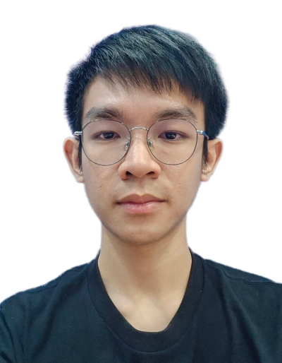

We are a team based in the [School of Computing, National University of Singapore](https://www.comp.nus.edu.sg).

You can reach us at the email `seer[at]comp.nus.edu.sg`

## Project team

### John Doe

[[github](https://github.com/johndoe)]
[[portfolio](team/johndoe.md)]

* Role: Project Advisor

### David Vicedo

[[github](http://github.com/vikeedough)]
[[portfolio](team/vikeedough.md)]

* Role: Developer
* Responsibilities: Integration

### Desean

[[github](http://github.com/deseansoh)] [[portfolio](team/deseansoh.md)]

* Role: Developer
* Responsibilities: Development of Features, Testing

### Jean Doe

[[github](http://github.com/johndoe)]
[[portfolio](team/johndoe.md)]

* Role: Developer
* Responsibilities: Dev Ops + Threading

### Zong Hua

[[github](http://github.com/wzhua02)]
[[portfolio](team/zonghua.md)]

* Role: Developer
* Responsibilities: UI
