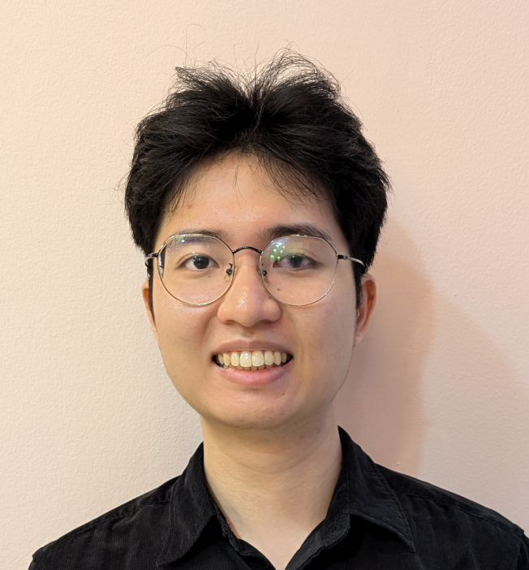
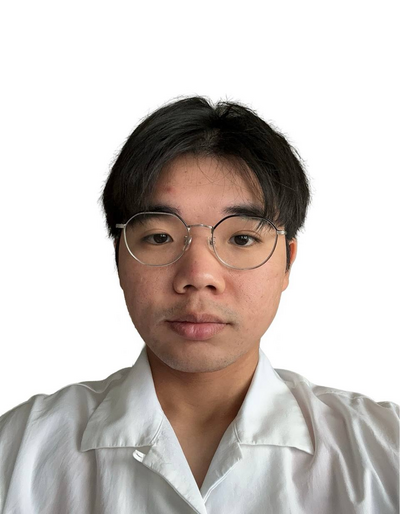

We are a team based in the [School of Computing, National University of Singapore](https://www.comp.nus.edu.sg).

You can reach us at the email `seer[at]comp.nus.edu.sg`

## Project team

### An Wei

[[github](https://github.com/anwe11)]
[[portfolio](team/anwei.md)]

* Role: Developer
* Responsibilities: Data

### David Vicedo

[[github](http://github.com/vikeedough)]
[[portfolio](team/vikeedough.md)]

* Role: Developer
* Responsibilities: Integration

### Desean

[[github](http://github.com/deseansoh)] [[portfolio](team/deseansoh.md)]

* Role: Developer
* Responsibilities: Development of Features, Testing

### Kai Ming

[[github](http://github.com/CloudKai)]
[[portfolio](team/cloudkai.md)]

* Role: Scheduling and tracking
* Responsibilities: In charge of defining, assigning, and tracking project tasks.

### Zong Hua

[[github](http://github.com/wzhua02)]
[[portfolio](team/zonghua.md)]

* Role: Developer
* Responsibilities: UI
