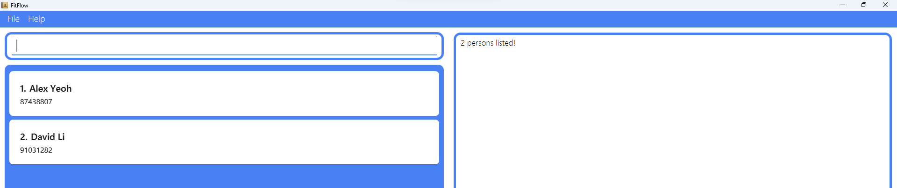

FitFlow is a **desktop app for personal trainers in Singapore to manage their clients, optimized for use via a Command Line Interface** (CLI) while still having the benefits of a Graphical User Interface (GUI). If you can type fast, FitFlow can manage your clients faster than traditional GUI apps.

* Table of Contents
{:toc}

--------------------------------------------------------------------------------------------------------------------

## Quick start

1. Ensure you have Java `17` or above installed in your Computer. 
   **Mac users:** Ensure you have the precise JDK version prescribed [here](https://se-education.org/guides/tutorials/javaInstallationMac.html).

1. Download the latest `.jar` file from [here](https://github.com/se-edu/addressbook-level3/releases).

1. Copy the file to the folder you want to use as the _home folder_ for your FitFlow app.

1. Open a command terminal, `cd` into the folder you put the jar file in, and use the `java -jar fitflow.jar` command to run the application. 
   A GUI similar to the below should appear in a few seconds. Note how the app contains some sample data. 
   

1. Type the command in the command box and press Enter to execute it. e.g. typing **`help`** and pressing Enter will open the help window. 
   Some example commands you can try:

   * `add n/John Doe p/81234567` : Adds a client named `John Doe` to the FitFlow.
   
   * `add n/Alice Pauline p/94351253 rs/Mon 1400 1600 g/Get fitter mh/Twisted right ankle l/Bishan ActiveSG Gym ots/1/2 1000 1200 t/friends` : Adds a client named `Alice Pauline` with many details such as her schedule, fitness goal, medical history and location.

   * `find John Doe` : Finds a specific client and displays their details.
   
   * `schedule monday` : Displays the sessions the personal trainer has with the clients on that day.

   * `schedule 17/2/25` : Displays the sessions the personal trainer has with the clients on that day.

   * `edit 1 p/81234567 rs/Tues 1600 1800 g/Do 10 pull ups` : Edits the details of the 1st client shown in the current list.

   * `delete 3` : Deletes the 3rd client shown in the current list.

   * `help` : Displays the list of available commands the user can use in FitFlow.

   * `help add` : Displays the format for the specific command in FitFlow.

   * `list` : Lists all clients.

   * `clear` : Deletes all clients.

   * `exit` : Exits the FitFlow app.

1. Refer to the [Features](#features) below for details of each command.

--------------------------------------------------------------------------------------------------------------------

## Features

**:information_source: Notes about the command format:** 

* Words in `UPPER_CASE` are the parameters to be supplied by the user. 
  e.g. in `add n/NAME`, `NAME` is a parameter which can be used as `add n/John Doe`.

* Items in square brackets are optional. 
  e.g `n/NAME [t/TAG]` can be used as `n/John Doe t/friend` or as `n/John Doe`.

* Items with `…`​ after them can be used multiple times including zero times. 
  e.g. `[t/TAG]…​` can be used as ` ` (i.e. 0 times), `t/friend`, `t/friend t/family` etc.

* Parameters can be in any order. 
  e.g. if the command specifies `n/NAME p/PHONE_NUMBER`, `p/PHONE_NUMBER n/NAME` is also acceptable.

* Extraneous parameters for commands that do not take in parameters (such as `help`, `list`, `exit` and `clear`) will be ignored. 
  e.g. if the command specifies `help 123`, it will be interpreted as `help`.

* If you are using a PDF version of this document, be careful when copying and pasting commands that span multiple lines as space characters surrounding line-breaks may be omitted when copied over to the application.

### Viewing help : `help`

Shows a message explaning how to access the help page.

Format: `help`

### Adding a client: `add`

Adds a client to FitFlow.

Format: `add n/NAME p/PHONE_NUMBER [rs/RECURRING_SCHEDULE]…​ g/GOALS mh/MEDICAL_HISTORY l/LOCATION [ots/ONE_TIME_SCHEDULE]…​ [t/TAG]…​`

:bulb: **Tip:**
A client can have any number of recurring schedule, one time schedule, or tags (including 0)

Examples:
* `add n/Alice Pauline p/94351253 rs/Mon 1400 1600 g/Get fitter mh/Twisted right ankle l/Bishan ActiveSG Gym ots/1/2 1000 1200 t/friends`
* `add n/Betsy Crowe t/friend g/Lose weight l/Jurong GymBox p/1234567 mh/Lower back injury rs/Wed 1500 1700`

### Locating clients by name: `find`

Find clients whose names contain any of the given keywords.

Format: `find KEYWORD [MORE_KEYWORDS]`

* The search is case-insensitive. e.g `hans` will match `Hans`
* The order of the keywords does not matter. e.g. `Hans Bo` will match `Bo Hans`
* Only the name is searched.
* Only the name and contact number of the client will be displayed
* Only full words will be matched e.g. `Han` will not match `Hans`
* Clients matching at least one keyword will be returned (i.e. `OR` search).
  e.g. `Hans Bo` will return `Hans Gruber`, `Bo Yang`

Examples:
* `find John` returns `john` and `John Doe`
* `find alex david` returns `Alex Yeoh`, `David Li` 
  

### View schedule: `view schedule`

Displays the sessions the personal trainer has with clients on that day.

Format: `view schedule [DAY] [DAY_SHORT_FORM] [DATE (DD/MM/YY)] [DATE (DD/MM)]`

* The search is case-insensitive. e.g `Monday` will match `monday`
* At least one of the optional fields must be provided.
* For Days, it will refer to the earliest upcoming day, for example if today is Tuesday, `view schedule Monday` will view the schedules on the Monday 6 days later.
* For Days, short-forms are allowed, `Monday` will match with `mon` and for Dates, the format has to be (DD/MM/YY) but the year can be omitted and the day and month can have a leading 0. e.g `25/2/2025`, `25/02/2025`, `25/2`, and `25/02` will all match.

Examples:
* `view schedule Monday` returns the list of clients with sessions on Monday.
* `view schedule 25/02/2025` returns the list of clients with sessions on 25/02/2025. 
  

### Editing a client : `edit`

Edits an existing client in FitFlow.

Format: `edit INDEX [n/NAME] [p/PHONE_NUMBER] [rs/RECURRING_SCHEDULE]…​ [g/GOALS] [mh/MEDICAL_HISTORY] [l/LOCATION] [ots/ONE_TIME_SCHEDULE]…​ [t/TAG]…​`

* Edits the client at the specified `INDEX`. The index refers to the index number shown in the displayed client list. The index **must be a positive integer** 1, 2, 3, …​
* At least one of the optional fields must be provided.
* Existing values will be updated to the input values.
* When editing recurring schedules, one time schedules or tags, the existing parameters of the client will be removed i.e it is not cumulative.
* You can remove all the client's recurring schedules, one time schedules and tags by typing `rs/`, `ots/`, and `t/` respectively without specifying any value after it.

Examples:
*  `edit 1 p/91234567 l/Anytime Fitness ots/4/4 1200 1400` Edits the phone number, location, and one time schedule of the 1st client to be `91234567`, `Anytime Fitness`, and `4/4 1200 1400` respectively.
*  `edit 2 n/Betsy Crower rs/ ots/ t/` Edits the name of the 2nd client to be `Betsy Crower` and clears all existing recurring schedules, one time schedules and tags.

### Deleting a client : `delete`

Deletes the specified client from FitFlow.

Format: `delete INDEX`

* Deletes the client at the specified `INDEX`.
* The index refers to the index number shown in the displayed client list.
* The index **must be a positive integer** 1, 2, 3, …​

### Help : `help`

Displays the description and formatting of commands in FitFlow.

Format: `help [add] [view] [schedule] [edit] [delete] [clear] [exit]`

* `help` will display all the available commands in FitFlow.
* `help` can be called on its own, calling help followed by a specific command will give the specific description and formatting for that command. e.g `help add` will display the description of the add command and its formatting.

Examples:
* `list` followed by `delete 2` deletes the 2nd client from FitFlow.
* `find Betsy` followed by `delete 1` deletes the 1st client in the results of the `find` command.

### Exiting the program : `exit`

Exits the program.

Format: `exit`

### Clearing all entries : `clear`

Clears all entries from FitFlow.

Format: `clear`

### Saving the data

FitFlow data are saved in the hard disk automatically after any command that changes the data. There is no need to save manually.

### Editing the data file

FitFlow data are saved automatically as a JSON file `[JAR file location]/data/addressbook.json`. Advanced users are welcome to update data directly by editing that data file.

:exclamation: **Caution:**
If your changes to the data file makes its format invalid, FitFlow will discard all data and start with an empty data file at the next run. Hence, it is recommended to take a backup of the file before editing it. 
Furthermore, certain edits can cause FitFlow to behave in unexpected ways (e.g., if a value entered is outside of the acceptable range). Therefore, edit the data file only if you are confident that you can update it correctly.

### Archiving data files `[coming in v2.0]`

_Details coming soon ..._

--------------------------------------------------------------------------------------------------------------------

## FAQ

**Q**: How do I transfer my data to another Computer? 
**A**: Install the app in the other computer and overwrite the empty data file it creates with the file that contains the data of your previous FitFlow home folder.

--------------------------------------------------------------------------------------------------------------------

## Known issues

1. **When using multiple screens**, if you move the application to a secondary screen, and later switch to using only the primary screen, the GUI will open off-screen. The remedy is to delete the `preferences.json` file created by the application before running the application again.
2. **If you minimize the Help Window** and then run the `help` command (or use the `Help` menu, or the keyboard shortcut `F1`) again, the original Help Window will remain minimized, and no new Help Window will appear. The remedy is to manually restore the minimized Help Window.

--------------------------------------------------------------------------------------------------------------------

## Command summary

Action | Format, Examples
--------|------------------
**Add** | `add n/NAME p/PHONE_NUMBER [rs/RECURRING_SCHEDULE]…​ g/GOALS mh/MEDICAL_HISTORY l/LOCATION [ots/ONE_TIME_SCHEDULE]…​ [t/TAG]…​`   e.g., `add n/Alice Pauline p/94351253 rs/Mon 1400 1600 g/Get fitter mh/Twisted right ankle l/Bishan ActiveSG Gym ots/1/2 1000 1200 t/friends`
**Find** | `find KEYWORD [MORE_KEYWORDS]`   e.g., `find John`
**View Schedule** | `view schedule [DAY] [DAY_SHORT_FORM] [DATE (DD/MM/YY)] [DATE (DD/MM)]`   e.g., `view schedule Monday`
**Edit** | `edit edit INDEX [n/NAME] [p/PHONE_NUMBER] [rs/RECURRING_SCHEDULE]…​ [g/GOALS] [mh/MEDICAL_HISTORY] [l/LOCATION] [ots/ONE_TIME_SCHEDULE]…​ [t/TAG]…​`  e.g.,`edit 1 p/91234567 l/Anytime Fitness ots/4/4 1200 1400`
**Delete** | `delete INDEX`  e.g., `delete 3`
**Help** | `help [add] [view] [schedule] [edit] [delete] [clear] [exit]`   e.g., `help add`
**Clear** | `clear`
**Exit** | `exit`

